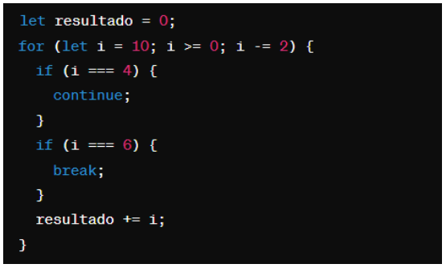

# Instruções

- Faça uma cópia deste arquivo .md para um repositório próprio
- Resolva as 6 questões objetivas assinalando a alternativa correta
- Resolva as 4 questões dissertativas escrevendo no próprio arquivo .md
  - lembre-se de utilizar as estruturas de código como ``esta aqui com ` `` ou
```javascript
//esta aqui com ```
let a = "olá"
let b = 10
print(a)
```
- Resolva as questões com uso do Visual Studio Code ou ambiente similar.
- Teste seus códigos antes de trazer a resposta para cá.
- Cuidado com ChatGPT e afins: entregar algo só para ganhar nota não faz você aprender e ficar mais inteligente. Não seja dependente da máquina!
- ao final, publique seu arquivo lista_01.md com as respostas em seu repositório, e envie o link pela Adalove. 

# Questões objetivas

**1)** O que o código a seguir faz?


Escolha a opção que responde corretamente:

<font color ="red">a) Imprime os números pares de 1 a 10.</font> (Correta)

<font color ="red">b) Imprime os números ímpares de 1 a 10.</font>(Errada)

<font color ="green">c) Imprime os números pares de 2 a 10.</font>(Correta)

<font color ="red">d) Imprime os números ímpares de 2 a 10.</font>(Errada)

______

**2)** Identificar a linha que falta no código para criar uma classe Veiculo com atributo marca, e uma classe Carro que herda de Veiculo com um método ligar(). 


No lugar onde está escrito “// linha” qual das opções abaixo deve estar para funcionar corretamente o código?

<font color ="green">A) let carro = new Carro("Toyota");</font>(Correta)

<font color ="red">B) let ligar = new ligar("Toyota");</font>(Errada)

<font color ="red">C) class Moto extends Veiculo {};</font>(Errada)

<font color ="red">D) carro1.ligar();</font>(Errada)

______

**3)** Qual é o valor de resultado após a execução deste código?



Escolha a opção que responde corretamente:

<font color ="green">A) 18</font>(Correta)

<font color ="red">B) 16</font>(Errada)

<font color ="red">C) 14</font>(Errada)

<font color ="red">D) 12</font>(Errada)

______

**4)** Como você criaria um método `acelerar()` em uma classe `Carro`, que recebe um parâmetro `velocidade` e o adiciona a um atributo `velocidadeAtual`?

<font color ="green">A) </font>(Correta)

<font color ="red">B) </font>(Errada)

<font color ="red">C) </font>(Errada)

<font color ="red">D) </font>(Errada)

______

**5)** Qual a forma correta de definir uma classe Carro em JavaScript, com um método ligar() e um atributo marca?

<font color ="green">A) </font>(Correta)

<font color ="red">B) </font>(Errada)

<font color ="red">C) </font>(Errada)

<font color ="red">D) </font>(Errada)

**6)** Observe o código abaixo:


Qual será a saída do código acima?

<font color ="green">A) "Olá, meu nome é João. Olá, meu nome é Maria."</font>(Correta)

<font color ="red">B) "Olá, meu nome é ."</font>(Errada)

<font color ="red">C) "João Maria"</font>(Errada)

<font color ="red">D) "undefined undefined"</font>(Errada)

______

# Questões dissertativas

**7)** Vamos criar um programa em JavaScript para entender classes, métodos e atributos!
Classe Animal:
- Crie uma classe chamada Animal.
- Adicione dois atributos: nome e idade.
- Adicione um método chamado descrever() na classe Animal.
  - Este método deve exibir no console uma descrição do animal com seu nome e idade.

Criando e manipulando Animais:
- Crie dois objetos da classe Animal: um chamado "cachorro" e outro "gato", com idades distintas.
- Para cada animal, chame o método descrever() para ver a descrição no console.

Dica: Utilize `console.log()` para exibir as informações!

Resposta:
```javascript
class Animal{
    constructor(nome, idade){
        this.nome = nome;
        this.idade = idade;
    }

    descricao(){
        return `O nome desse animal é ${this.nome} e ele tem ${this.idade} anos de idade`
    }
}
let animal1 = new Animal("cachorro", "3")
let animal2 = new Animal("gato", "2")

console.log(animal1.descricao());
console.log(animal2.descricao());
````
______

**8)** Nos últimos dias tivemos a oportunidade de ter contato com Programação Orientada a Objetos, e tivemos contato com o tema "herança". Herança é um princípio de orientação a objetos, que permite que classes compartilhem atributos e métodos. Ela é usada na intenção de reaproveitar código ou comportamento generalizado ou especializar operações ou atributos. Então vamos praticar esse conteúdo nessa questão.
Vamos criar um programa em JavaScript para entender classes, métodos, atributos e herança!

Classe Animal:
- Crie uma classe chamada Animal.
- Adicione dois atributos: nome e idade.
- Adicione um método descrever() que exiba no console uma descrição do animal com seu nome e idade.

Classe Gato (Herda de Animal):
- Crie uma classe chamada Gato que herda da classe Animal.
- Adicione um atributo extra cor específico para gatos.
- Adicione um método miar() que exiba no console o som que um gato faz.

Criando Animais:
- Crie dois objetos da classe Animal: um chamado cachorro e outro gato, com idades distintas.
- Para o gato, também defina a cor.

Chamando os Métodos:
- Para cada animal, chame o método descrever() para ver a descrição no console.
- Para o gato, chame o método miar() para "ouvir" o som que ele faz (é também para ver o som no console).

Dica: Utilize console.log() para exibir as informações!

Resposta:
``` javascript
class Animal{
    constructor(nome, idade){
        this.nome = nome
        this.idade = idade
    }

    descrever(){
        return `O nome desse animal é ${this.nome}, ele tem ${this.idade} anos de idade.`
    }
}

class Gato extends Animal{
    constructor(nome, idade, cor){
        super(nome, idade);
        this.cor = cor
    }

    miar(){
      return `Ele faz Miau`
    }
}   

let gato = new Gato("frajola", "3", "preto e branco")
let cachorro = new Animal("Scooby", "4")

console.log(gato.descrever() + gato.miar())
console.log(cachorro.descrever())
```


______

**9)** Vamos criar um programa em JavaScript para somar notas!

Classe SomadorDeNotas:
- Crie uma classe chamada SomadorDeNotas.
- Adicione um atributo total inicializado com 0 para armazenar a soma das notas.

Método adicionarNota:
- Adicione um método chamado adicionarNota(nota) na classe SomadorDeNotas.
- Este método deve receber um parâmetro nota e somá-lo ao atributo total.

Criando o Somador e Adicionando Notas:
- Crie um objeto da classe SomadorDeNotas, chamado somador.
- Utilize o método adicionarNota(nota) para adicionar algumas notas ao somador.

Chamando o Método para Ver o Total:
- Após adicionar todas as notas, chame um método verTotal() para exibir o total das notas adicionadas.

Dica: Utilize console.log() para exibir as informações!

Resposta:
```javascript
class SomadorDeNotas {
    constructor() {
        this.total = 0;
    }

    adicionarNota(nota) {
        this.total += nota;
    }

    verTotal() {
        console.log(`O total das notas é: ${this.total}`);
    }
}

let somador = new SomadorDeNotas();

somador.adicionarNota(8);
somador.adicionarNota(7.5);
somador.adicionarNota(9.2);

somador.verTotal();
```

______

**10)** Imagine que você está criando um programa em JavaScript para uma escola. Neste programa, existem diferentes tipos de funcionários, cada um com suas próprias características. Considere as seguintes classes:

Funcionário:
- atributo: Nome
- atributo: Idade
- atributo: Salário base
- método: calcularSalario() - Este método calcula o salário total do funcionário. Para cada tipo de funcionário, o cálculo será diferente.

Professor (herança de Funcionário):
- atributo: Disciplina
- atributo: Horas de aula por semana
- método: calcularSalario() - Para calcular o salário do professor, multiplicamos suas horas de aula pelo valor da hora/aula.

Agora, sua tarefa é escrever um código em JavaScript que crie as classes Funcionário e Professor, com suas características e métodos descritos acima. Depois de criar as classes, crie:
- Dois objetos do tipo Professor com informações fictícias.
- Para cada objeto, chame o método calcularSalario() e mostre o salário calculado no console.

Certifique-se de explicar cada parte do código utilizando comentários, explicando para que serve cada atributo e método, bem como a lógica por trás do cálculo de salário para o tipo de funcionário Professor.

Resposta:
```javascript
// Definição da classe Funcionario
class Funcionario {
    // Construtor da classe Funcionario
    constructor(nome, idade, salarioBase){
        // Inicializa as propriedades nome, idade e salarioBase com os valores passados como argumentos
        this.nome = nome;
        this.idade = idade;
        this.salarioBase = salarioBase;
    }

    calcularSalario(){
        
    }
}

// Definição da classe Professor que herda da classe Funcionario
class Professor extends Funcionario {
    // Construtor da classe Professor que chama o construtor da classe pai (Funcionario)
    constructor(nome, idade, salarioBase, disciplina, horaAula){
        super(nome, idade, salarioBase); // Constructor para puxar atributos e adicionar novos
        // Inicializa as propriedades do Professor
        this.disciplina = disciplina;
        this.horaAula = horaAula;
    }

    // Método calcularSalario() para calcular o salário do professor
    calcularSalario(){
        // Retorna uma string com o salário do professor calculado multiplicando o número de horas aula pelo salário base
        return `Prof ${this.nome} recebe ${this.horaAula * this.salarioBase} por mês.`;
    }
}

// Criação de dois objetos (professores)
let prof1 = new Professor("Israel", "33", 50, "matemática", 160);
let prof2 = new Professor("Bianca", "31", 57, "ciências", 178);

// Exibe o salário calculado para cada professor no console
console.log(prof1.calcularSalario());
console.log(prof2.calcularSalario());

```
